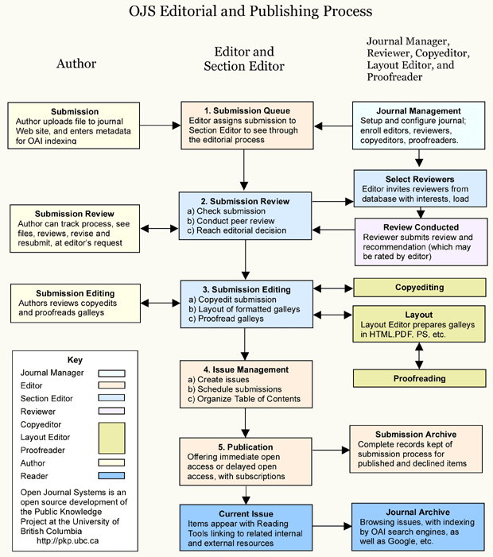
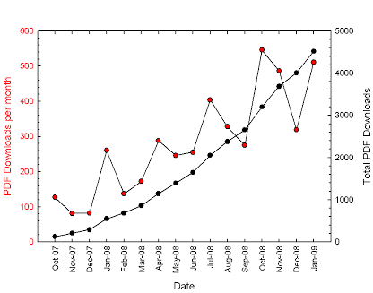

[Home](index.md) |[About](about.md) | [People](people.md) | [Policies](policies.md) | [Submissions](submissions.md) 

In December 2006, with the purchase of the domain address http://www.jphysstu.org/, the Journal of Physics Students (JPS) ( eISSN : 1307 8194) began its journey. Founder editor was a PhD student. The very first issue was published in October 2007. JPS used [Open Journal Systems 2.1.1.0](http://pkp.sfu.ca/ojs/), which is open source journal management and publishing software developed, supported, and freely distributed by the Public Knowledge Project under the GNU General Public License. JPS was an automated online journal with different roles which are shown in Fig. 1.

Fig. 1 Editorial and Publishing scheme used in JPS.

Journal was published in 3 volumes and 6 issues. Here is some statistics for the volumes 1&2*. 

Table 1. Yearly statistics for issues, articles reviewed, users and readers.
2007
Issues published             1
Items published              10
Total submissions           16
Peer reviewed 12
Accept               9 (60%)
Decline              5 (33%)
Resubmit          0 (0%)
Days to review               60
Days to publication       101
Registered users             71 (71 new)
Registered readers        50 (50 new)

2008
Issues published             4
Items published              13
Total submissions           34
Peer reviewed 22
Accept               14 (45%)
Decline              12 (39%)
Resubmit          1 (3%)
Days to review               76
Days to publication       130
Registered users             180 (109 new)
Registered readers        118 (68 new)

As it can easily seen from the statistics listed in Table 1, days to review and days to publication increased in the latest issues, however acception percentage is decreased. This indicates a more strict peer-review process in the latest issues. Nearly half acception percentage show the success of serious double-blind peer-review process.

Fig. 2 Monthly and total PDF article downloads for JPS.

In Fig. 2, linearly increased monthly PDF download number can be seen. This is because of linearly increased article number. Scatter in the PDF downloads per month is due to 3 month range per issue. Exponential behavior in total PDF download does not include any scatter because of the past issues influence. 

Journal was a complete success and it reached its goals. However, for a student journal, more than half of the authors and nearly all of the reviewers were PhD holders. After the Editor's PhD earning at December 2008, journal became studentless student journal. In the forming editorial board, nearly all board members were PhD holders.To keep the journal as a student journal, Editor decided to close JPS just after earning his PhD. In January 2009, last issue (Postremum) was published (Volume 3, Issue 1).

*: Volume 3 data is not complete.
